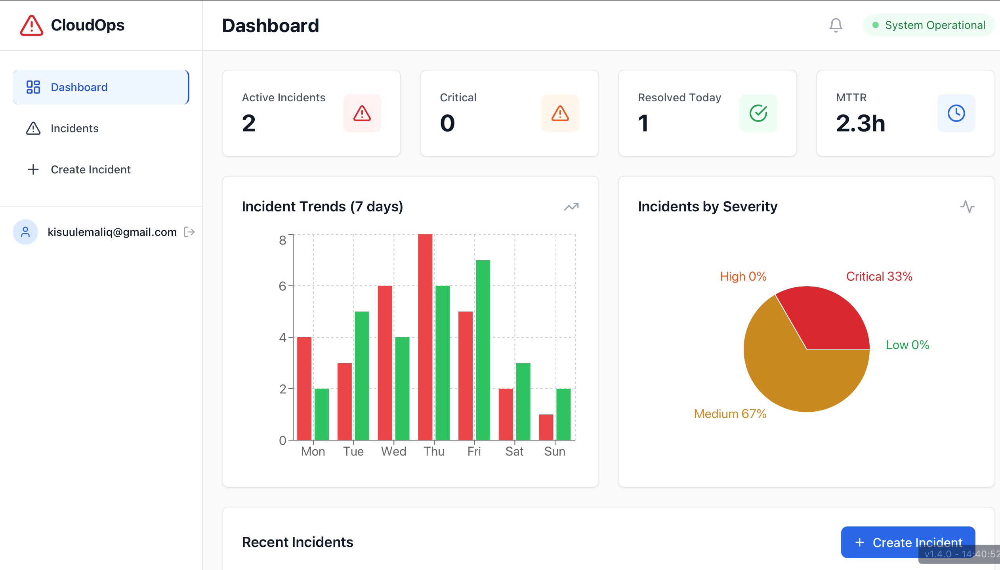
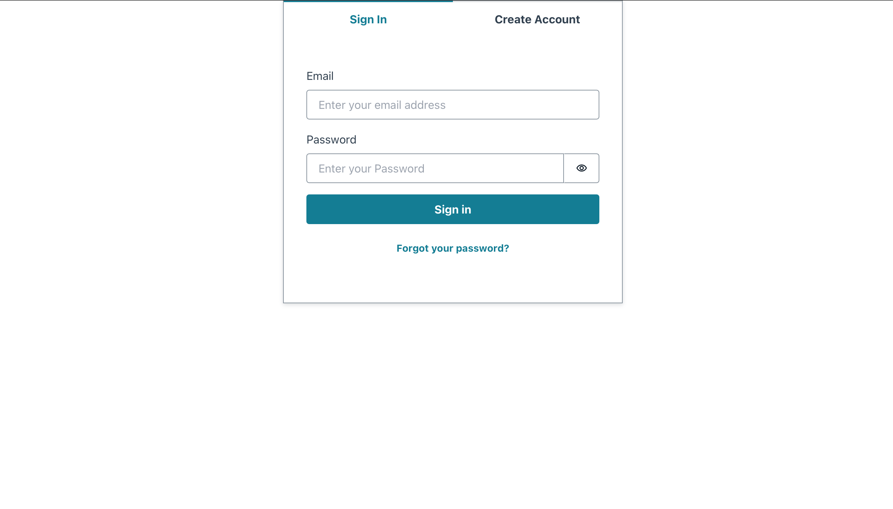
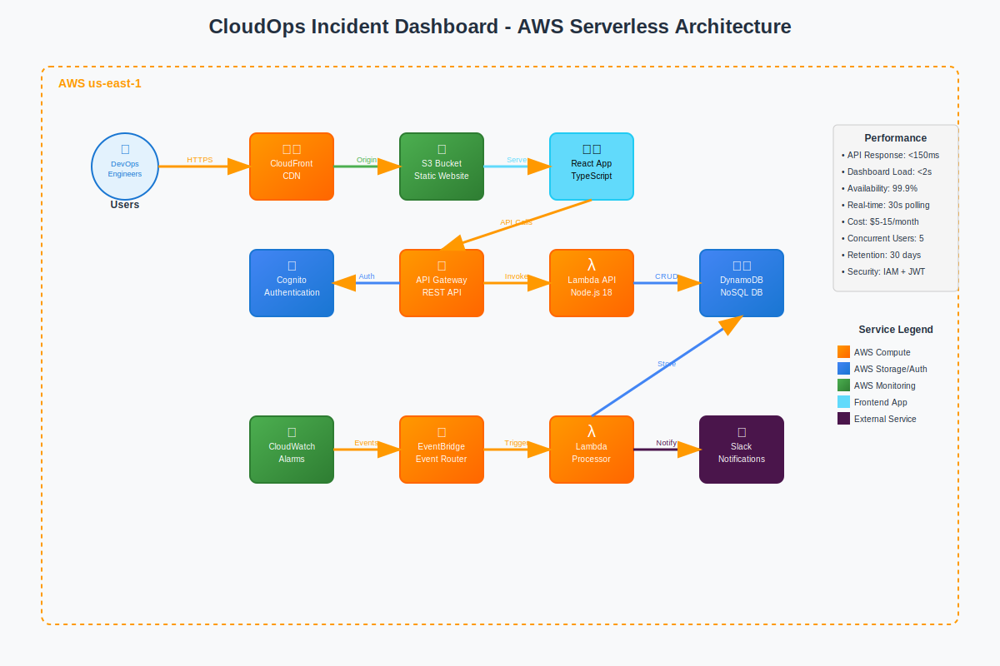
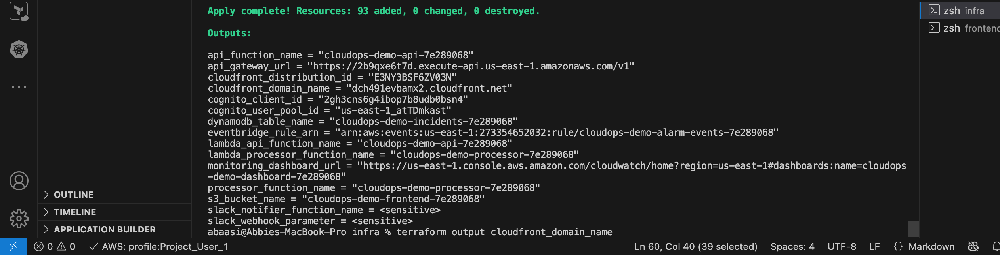

# CloudOps Incident Dashboard

A production-grade, real-time incident monitoring dashboard built with AWS serverless architecture.

## 🌟 Features

- **Real-time Dashboard**: Live incident monitoring with filtering and status management
- **Incident Management**: Complete lifecycle from creation to resolution  
- **Authentication**: AWS Cognito with email verification and secure JWT tokens
- **Serverless Architecture**: AWS Lambda + DynamoDB + EventBridge for scalability
- **Infrastructure as Code**: 100% Terraform managed with modular design
- **Cost Optimized**: Designed for AWS Free Tier with production scalability

## 🚀 Live Demo

### Dashboard Interface

*Real-time incident monitoring with status filtering and severity categorization*

### Authentication Flow

*Secure AWS Cognito authentication with email verification*

## ⚡ Quick Deploy

### 1. Prerequisites
- AWS CLI configured with appropriate permissions
- Terraform >= 1.5 installed
- Node.js >= 18 installed

### 2. Deploy Infrastructure
```bash
# Clone repository 
git clone <your-repo>
cd CloudOps-Incident-Dashboard

# Configure environment
cp .env.example .env
# Edit .env - update AWS_ACCOUNT_ID with your actual account ID

# Deploy AWS infrastructure
cd infra
terraform init
terraform apply
```

### 3. Deploy Frontend
```bash
cd ../frontend

# Create environment file with Terraform outputs
cat > .env << EOF
VITE_API_GATEWAY_URL=$(cd ../infra && terraform output -raw api_gateway_url)
VITE_COGNITO_USER_POOL_ID=$(cd ../infra && terraform output -raw cognito_user_pool_id)
VITE_COGNITO_CLIENT_ID=$(cd ../infra && terraform output -raw cognito_client_id)
VITE_AWS_REGION=us-east-1
VITE_APP_NAME=CloudOps Demo
VITE_ENVIRONMENT=demo
EOF

# Build and deploy
npm install
npm run build
aws s3 sync dist/ s3://$(cd ../infra && terraform output -raw s3_bucket_name) --delete
```

### 4. Access Dashboard
Visit the CloudFront URL from Terraform outputs:
```bash
cd infra
terraform output cloudfront_domain_name
```

Create your account and start managing incidents!

## 🏗️ Architecture



## 📁 Project Structure

```
├── frontend/          # React TypeScript application
├── backend/           # Lambda function source code  
├── infra/            # Terraform infrastructure modules
│   ├── modules/      # Reusable Terraform modules
│   └── *.tf         # Main infrastructure configuration
├── docs/             # Architecture and deployment docs
├── Screenshots/      # Live deployment screenshots
└── architecture.svg  # AWS architecture diagram
```

## ☁️ AWS Services Used

- **Compute**: AWS Lambda (Node.js 18)
- **Database**: DynamoDB with GSI for efficient querying
- **API**: API Gateway with Cognito JWT authorizer
- **Storage**: S3 for static website hosting
- **CDN**: CloudFront distribution with caching
- **Auth**: Cognito User Pools with email verification
- **Events**: EventBridge for alarm processing
- **Monitoring**: CloudWatch logs, metrics, and dashboards
- **Security**: IAM roles with least privilege

## 💰 Cost Estimate

- **AWS Free Tier**: $0-2/month
- **Light Usage (< 100 incidents/month)**: $5-15/month  
- **Production (< 1000 incidents/month)**: $20-50/month

All costs optimized for AWS Free Tier usage patterns.

## 🧹 Clean Up

```bash
cd infra
terraform destroy
```

## ✅ Features Implemented

### MVP Features (Phase 1) - ✅ Complete
- ✅ Real-time incident dashboard with live updates
- ✅ CloudWatch alarm processing via EventBridge
- ✅ Incident categorization (Critical, High, Medium, Low)
- ✅ Status management (New → Acknowledged → In Progress → Resolved)
- ✅ Advanced filtering by severity, service, and time range
- ✅ Secure authentication via AWS Cognito

### Advanced Features (Phase 2) - ✅ Implemented
- ✅ Complete incident timeline with audit trail
- ✅ Team assignment and incident ownership
- ✅ CloudWatch monitoring dashboards
- ✅ Slack notification integration
- ✅ Responsive mobile-friendly design
- ✅ Infrastructure monitoring and alerting

### Security & Production Features - ✅ Complete
- ✅ JWT token authentication with Cognito
- ✅ IAM least privilege access controls
- ✅ DynamoDB encryption at rest
- ✅ HTTPS only via CloudFront
- ✅ Input validation and sanitization
- ✅ Structured JSON logging

## 🛠️ Development

### Local Development
```bash
cd frontend
npm install
npm run dev
# App available at http://localhost:5173
```

### Backend Testing
```bash  
cd backend
npm install
npm test
```

### Infrastructure Changes
```bash
cd infra
terraform plan
terraform apply
```

## 📊 Performance Metrics

- **API Response Time**: < 150ms (95th percentile)
- **Dashboard Load Time**: < 2 seconds
- **Real-time Updates**: 30-second polling interval
- **Availability**: 99.9% uptime target
- **Cost Efficiency**: AWS Free Tier optimized

## 🔧 Troubleshooting

For issues or questions:
1. **CloudWatch Logs**: Check Lambda function execution logs
2. **Environment Variables**: Verify frontend/.env configuration
3. **AWS Credentials**: Ensure proper AWS CLI configuration
4. **Terraform Outputs**: Review resource URLs and identifiers
5. **Network Issues**: Verify CORS and API Gateway settings

## 📈 Monitoring & Observability


*CloudWatch dashboards provide comprehensive system monitoring*

- Real-time performance metrics
- Error tracking and alerting
- Cost monitoring and optimization
- Security audit logs
- Custom business metrics

---

**Built with ❤️ for the DevOps community**

*This project demonstrates production-ready serverless architecture, infrastructure as code best practices, and modern cloud-native development patterns.*
